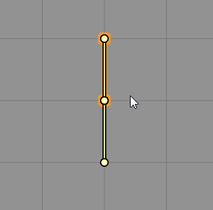
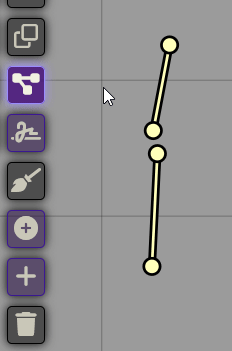
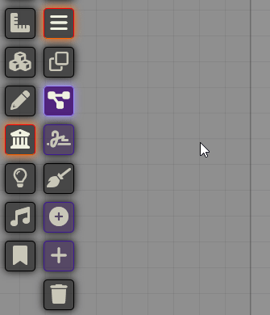
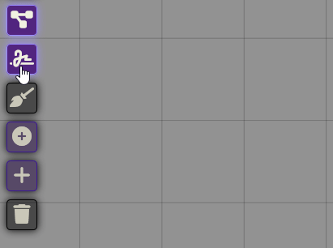
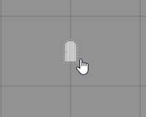
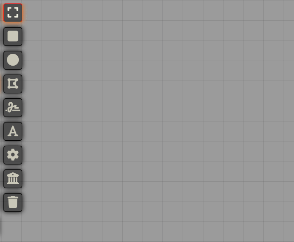

# Monk's Wall Enhancement
Add-On Module for Foundry VTT
Improvements to the Core Wall functionality.

This is a spin off from the original Monk's Little Details module.  The original was getting a little large and I wanted to do more work with the Wall Functionality.

## Installation
Simply use the install module screen within the FoundryVTT setup

## Usage & Current Features

### Drag wall points together

When selected, dragging a wall point to a new location will also move any other wall points that exactly overlapped the first one.  So instead of having to move both wall points to the new location it will maintain the connection between wall joints and move the second one.  Saves me some time when editing lengths of wall. This button can be enabled or disabled in the module settings.

### Double-click to create a new drag point

If you want to split a wall into two parts, enable this in the module setting, then double-clicking somewhere along the line will split it into two parts.

### Join Points

While having some wall segments selected, it will go through the points and find ones that are close to each other, and match them up. If you have snap to grid on it won't join points; to use this feature you need to be holding down the shift key.

### Condense Wall Types

A setting that can enabled in the module settings, it condenses the wall types down to one button to select your wall type.

### Freehand Wall Drawing

Toggle this setting on and when you draw a wall you can draw it like you would a line.  When you release the button, it will try and find the most economical use of line segments to create the wall.  This is great for cave walls, you can draw along the edge of the cavern image and have a very reasonable approximation. The tolerance can adjusted in the module settings.

### Toggle Secret Door

Holding down the CTRL key while Right Clicking a door will toggle it from being a secret door to a regular door.

### Convert Drawing to Walls

Converts the currently selected drawings into walls.

### Automatic Wall Adjustment when Resizing Scene

When changing a scene's grid or canvas size, this adds a prompt asking if you want to it to automatically attempt to adjust walls to match the new sizes.

## Bug Reporting
I'm sure there are lots of issues with it.  It's very much a work in progress.
Please feel free to contact me on discord if you have any questions or concerns. ironmonk88#4075

## Support

If you feel like being generous, stop by my <a href="https://www.patreon.com/ironmonk">patreon</a>.  Not necessary but definitely appreciated.

## License
This Foundry VTT module, writen by Ironmonk, is licensed under [GNU GPLv3.0](https://www.gnu.org/licenses/gpl-3.0.en.html), supplemented by [Commons Clause](https://commonsclause.com/).

This work is licensed under Foundry Virtual Tabletop <a href="https://foundryvtt.com/article/license/">EULA - Limited License Agreement for module development from May 29, 2020.</a>
